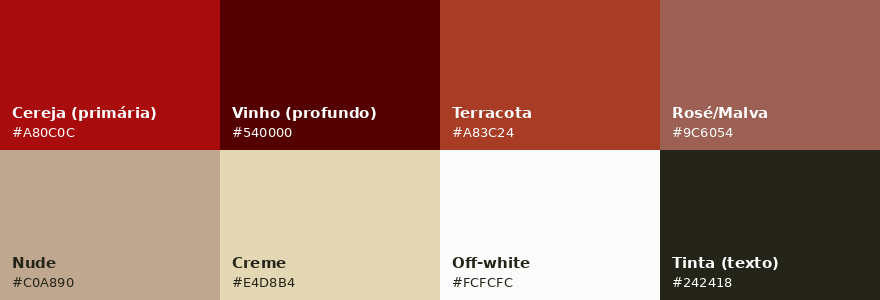

# Identidade Visual — Cereja Love Shop

> Paleta **extraída dos pixels das imagens de referência** deste diretório (`ref-01.jpeg` … `ref-12.jpeg`). Não é sugestão genérica — reflete o material da marca.
> As imagens em `ref-*.jpeg` são a referência de estilo canônica para o design system; a UI final deve conversar com elas.

## Conceito
"Cereja" (cherry) → marca **quente, romântica e sensual, porém elegante** — não apelativa. A cor de assinatura é o vermelho-cereja/vinho, ancorada em neutros nude e creme que transmitem sofisticação e conforto (alinhado à estratégia de discrição e bem-estar do projeto).

## Paleta

| Papel | Nome | HEX | Uso sugerido |
|---|---|---|---|
| **Primária** | Cereja | `#A80C0C` | CTAs, destaques, logo, preço em promoção |
| **Profunda** | Vinho | `#540000` | Header/footer, superfícies escuras, hover de CTA |
| Secundária | Terracota | `#A83C24` | Realces secundários, badges |
| Apoio | Rosé/Malva | `#9C6054` | Detalhes, ícones, estados sutis |
| Neutro | Nude | `#C0A890` | Bordas, divisórias, texto secundário |
| Fundo claro | Creme | `#E4D8B4` | Fundos de seção, cards |
| Base | Off-white | `#FCFCFC` | Fundo principal, superfícies |
| Texto | Tinta | `#242418` | Texto principal |



## Tokens (CSS variables)

```css
:root {
  --color-cereja:     #A80C0C;  /* primária */
  --color-vinho:      #540000;  /* profunda */
  --color-terracota:  #A83C24;
  --color-rose:       #9C6054;
  --color-nude:       #C0A890;
  --color-creme:      #E4D8B4;
  --color-offwhite:   #FCFCFC;
  --color-ink:        #242418;

  /* semânticos */
  --bg:               var(--color-offwhite);
  --bg-alt:           var(--color-creme);
  --surface-dark:     var(--color-vinho);
  --primary:          var(--color-cereja);
  --primary-hover:    var(--color-vinho);
  --text:             var(--color-ink);
  --text-muted:       var(--color-nude);
  --border:           var(--color-nude);
}
```

## Extensão Tailwind (`tailwind.config`)

```js
theme: {
  extend: {
    colors: {
      cereja:    '#A80C0C',
      vinho:     '#540000',
      terracota: '#A83C24',
      rose:      '#9C6054',
      nude:      '#C0A890',
      creme:     '#E4D8B4',
      offwhite:  '#FCFCFC',
      ink:       '#242418',
    },
  },
}
```

## Direção de design
- Base clara (off-white/creme) com **cereja** como acento pontual e **vinho** para profundidade — evitar "afogar" a tela em vermelho.
- Tipografia com contraste elegante (uma serifada para títulos + uma sans limpa para texto costuma combinar com esse tom).
- Fotografia de produto seguindo o clima das referências; lembrar do **thumbnail discreto por padrão** (flag `is_sensitive_media`) exigido no spec.
- Cantos suaves, respiro generoso, microinterações discretas — sofisticação acima de "sensualização" explícita.
